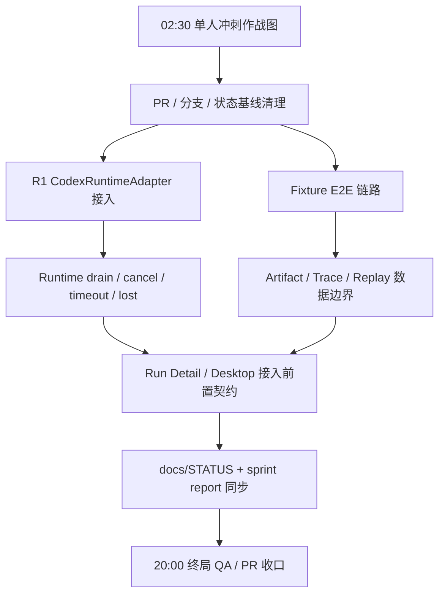

# Cairn 5 月单人冲刺任务图

> 状态：Accepted for sprint execution
> 日期：2026-05-18
> 范围：2026-05-18 02:30 到 2026-05-18 20:00 的单人冲刺，以及 2026-05-31 前的任务池基线
> Owner：Codex

---

## 1. 背景

Cairn 已合并最新战略文档，当前定位是本地优先、可自托管的 AI 工程工作台 / Agent 工程控制台。R1 的主线不是扩 Web、团队权限或 marketplace，而是把个人本地工作台的 runtime control plane 与 evidence layer 打成可信闭环。

本月白霓和海棠转去其他项目，Cairn 暂由 Codex 单人负责。因此 5 月剩余计划必须按单人吞吐量设计：每次只推进可验证的小 slice，优先收口 PR、验证失败和 R1 可演示闭环，不做大而散的并行路线。

---

## 2. 冲刺目标

到 2026-05-18 20:00：

1. 建立半小时动态任务池，让自动任务能按仓库状态连续推进。
2. 至少形成一份可提交的单人冲刺作战图。
3. 至少推进一个 R1 核心工程 slice 或完成明确的阻塞报告。
4. 保持 `origin/develop` 可验证，优先不引入无法收口的大分支。
5. 输出 20:00 终局收口报告：完成项、未完成项、阻塞项、验证结果、下一轮任务。

到 2026-05-31：

1. R1 Codex runtime/artifact/trace 闭环接近可演示状态。
2. Workspace Core、Runtime Gateway、Application、Artifact / Trace read API 的边界一致。
3. Desktop Shell 接真实 sidecar 前的契约、安全与 UI 数据需求清楚。
4. 项目文档持续反映真实进度，不把静态壳或 preview 误写成已接真实数据。

---

## 3. 非目标

- 不创建 `apps/web`。
- 不做企业级多租户治理。
- 不做 marketplace。
- 不做拖拽 workflow builder。
- 不把 Desktop 静态壳扩成无边界本地自动化工具。
- 不给白霓或海棠安排 Cairn 本月任务。
- 不把 Codex CLI 首发接入写成对 OpenAI 或 Codex 的长期绑定。

---

## 4. 推荐策略

采用 **动态任务池 + 半小时守门**。

每个自动任务从最新 `origin/develop` 开独立 worktree，先检查开放 PR、远程分支、上一轮产物和验证结果；如果有未收口 PR 或失败验证，优先收口。没有阻塞时，再从任务池选择最高优先级且不与已有工作冲突的 slice。

不采用固定排程表的原因：

- 半小时任务很容易受 CI、PR、依赖安装和测试耗时影响。
- 当前主线会不断被自动任务推进，固定“第 N 轮做某文件”容易与上一轮冲突。
- 动态任务池能让每轮任务自然处理最新事实。

---

## 5. 任务图

---

## 6. 任务池

| 优先级 | 任务                                    | 目标产物                         | 验证                                                                      |
| ------ | --------------------------------------- | -------------------------------- | ------------------------------------------------------------------------- |
| P0     | 单人冲刺作战图                          | 本文档或后续实施计划             | `pnpm exec markdownlint-cli2 <file>`、`pnpm exec prettier --check <file>` |
| P0     | PR / 分支状态守门                       | 合并、修复或风险报告             | `gh pr list`、`git fetch --all --prune`、相关 CI                          |
| P1     | CodexRuntimeAdapter 接入 RuntimeAdapter | 小 PR + runtime_gateway 测试     | 目标包测试、`pnpm run check`                                              |
| P1     | Fixture E2E demo loop                   | workspace-core/application 测试  | `pnpm --filter @cairn/workspace-core test`、`pnpm run check`              |
| P1     | Runtime drain / cancel / timeout / lost | 契约、状态推进或测试             | 目标包测试、状态机文档同步                                                |
| P2     | Artifact / Trace / Replay 边界收紧      | schema/docs/tests 一致性         | shared_contracts/workspace-core 测试、docs lint                           |
| P2     | Desktop sidecar 接入前置契约            | 设计、安全 checklist 或 API 草案 | docs lint、必要时 typecheck                                               |
| P3     | `docs/STATUS`、roadmap、QA 报告同步     | 文档 PR                          | docs lint、format check                                                   |
| P3     | standards / CI 小修                     | standards check 或 CI 修复       | `pnpm run standards:check`、相关 CI                                       |

---

## 7. 半小时轮次规则

每轮自动任务必须只做一件小事。

1. 从最新 `origin/develop` 开隔离 worktree。
2. 先查 `gh pr list`、`git status --short --branch`、最近 `origin/develop` 提交。
3. 如果存在失败 CI、冲突 PR、未收口验证，优先修复或写清阻塞。
4. 如果没有阻塞，从任务池选择一个不冲突的 P0/P1 slice。
5. 修改必须小步提交到短分支；不要直接 push `develop`。
6. 每轮至少运行与改动匹配的验证。
7. 输出本轮完成、验证结果、风险和下一轮建议。

---

## 8. 单人工作量估算

### 2026-05-18 02:30 到 20:00

| 工作类型    |     预估投入 | 说明                                                          |
| ----------- | -----------: | ------------------------------------------------------------- |
| 计划与守门  | 2.0-3.0 小时 | 作战图、PR/分支检查、终局报告                                 |
| R1 核心工程 | 7.0-9.0 小时 | Codex adapter、fixture E2E、runtime drain/cancel 中选小 slice |
| 验证与修复  | 3.0-4.0 小时 | `check`、目标测试、CI/standards 小修                          |
| 文档同步    | 1.0-2.0 小时 | `STATUS`、设计文档、风险记录                                  |

### 2026-05-18 到 2026-05-31

单人有效产能按 1.0 人月中的 0.5-0.6 人月估算，预留 CI、review、返工和上下文切换成本。

| 方向                           | 建议占比 | 目标                                                |
| ------------------------------ | -------: | --------------------------------------------------- |
| R1 runtime/artifact/trace 闭环 |      50% | 让 Codex 或 fixture 路径可演示                      |
| Desktop 接入前置               |      20% | sidecar、preload allowlist、Run Detail 数据需求清楚 |
| QA / CI / standards            |      15% | 不让主线散架                                        |
| 文档与计划同步                 |      15% | 让自动任务和人类决策基于同一事实                    |

---

## 9. 验证门禁

按改动范围选择验证，不用每轮都跑全量，但合并前必须有充分证据。

| 改动范围                     | 最低验证                                                                                        |
| ---------------------------- | ----------------------------------------------------------------------------------------------- |
| 文档-only                    | `pnpm exec markdownlint-cli2 <files>`、`pnpm exec prettier --check <files>`、`git diff --check` |
| shared contracts             | 包测试、`pnpm run check`                                                                        |
| application / workspace-core | 目标包测试、`pnpm run check`                                                                    |
| runtime_gateway              | runtime_gateway 测试、`pnpm run check`                                                          |
| UI / desktop                 | typecheck/lint/build，必要时浏览器或 Electron 预览                                              |
| 合并前收口                   | `pnpm run check`、`pnpm test`、`pnpm run build`、`pnpm run standards:check`                     |

---

## 10. 风险与处理

| 风险                      | 处理                                                   |
| ------------------------- | ------------------------------------------------------ |
| 半小时任务互相撞分支      | 每轮先查 PR/分支，优先收口已有工作，不重复做同一 slice |
| 本地 `develop` 与远端分叉 | 全部自动任务基于 `origin/develop` 开 worktree          |
| 任务过大无法半小时完成    | 切成测试、契约、实现、文档四类小 PR                    |
| CI 变慢或失败             | 下一轮优先修 CI，不继续堆新功能                        |
| 文档与实现不一致          | 每个工程 slice 都同步 `docs/STATUS` 或相关设计文档     |
| R1 范围外诱惑             | 以产品边界为硬约束，不启动 Web/R2/企业治理             |

---

## 11. 20:00 收口报告格式

终局任务输出必须包含：

1. 已完成：按 PR / 分支 / commit 列出。
2. 验证：列出命令、结果和失败项。
3. 未完成：说明原因，不用粉饰。
4. 阻塞：权限、CI、设计不明确、依赖缺口。
5. 下一轮：按 P0/P1/P2 列 24 小时任务。
6. 建议清理：远程短分支、过期 PR、重复文档。

---

## 12. 确认状态

本任务图已由 Owner 确认，用作 2026-05-18 半小时自动冲刺的基准。后续如自动任务产出更细的实施计划，应以本文的目标、非目标和任务池优先级为上位约束。
